import StatTile from '../../components/StatTile.astro';
import StatGrid from '../../components/StatGrid.astro';

## Context

### The Brief

Redesign YouLend’s white-label merchant financing flow to increase capital approval conversions across global partner platforms (e.g., eBay, Amazon, Shopify).

### The Architectural Challenge

Abstracting complex risk assessments, open banking data connections, and multi-currency terms into an adaptive, low-friction application journey that abides by strict partner styling limits.

### The Operational Win

Replaced rigid application steps with a responsive UI, significantly cutting drop-off rates and support queries.

* * *

## Research & Discovery

### Analytics

Before I joined YouLend, Yvonne had spent time mapping the journey in Miro, and using Heap analytics to identify the most problematic steps in the journey.

#### Landing

Landing page that explains the product, and an indication of what you can borrow

#### Business

Tell us your business name, type, country and address

#### Personal

Tell us about all shareholders who own at least 25% of the company

#### Financial

Connect to your business bank via Open Banking, or submit PDF statements

The biggest areas of drop-off were the Landing page (47% conversion) and Financial (56% conversion) – unsurprising as these were the areas that required the biggest ‘leaps-of-faith’.

### Customer Support

Yvonne gathered feedback from our CS team, who said ‘help with sign up’ was one of their biggest support tasks. If a customer didn’t understand how to sign up, then the CS team would help them manually; a very laborious and time-consuming process.

### Metrics

With this in mind, we aimed for the following metrics:

Increase in sign-up conversion (landing page)

Increase in Stage 1 conversion (submitting application)

Increase in customer NPS mentioning application

* * *

## Design

### Landing page

Complete redesign of the landing page to emphasise the product’s features + benefits, along with social proof and some key information.

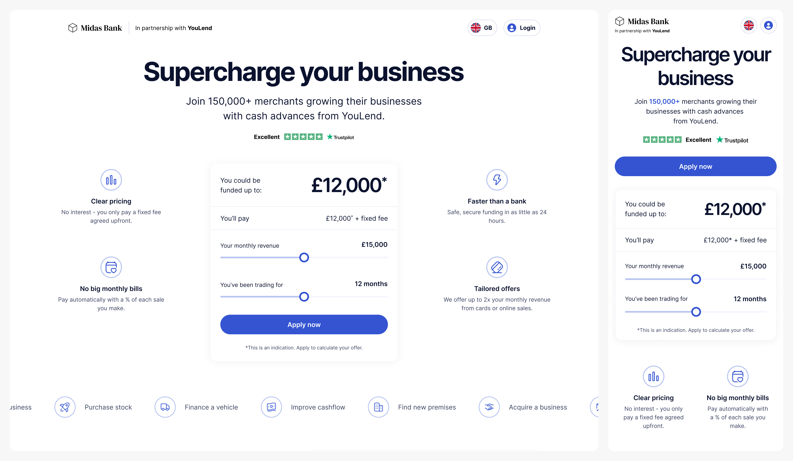

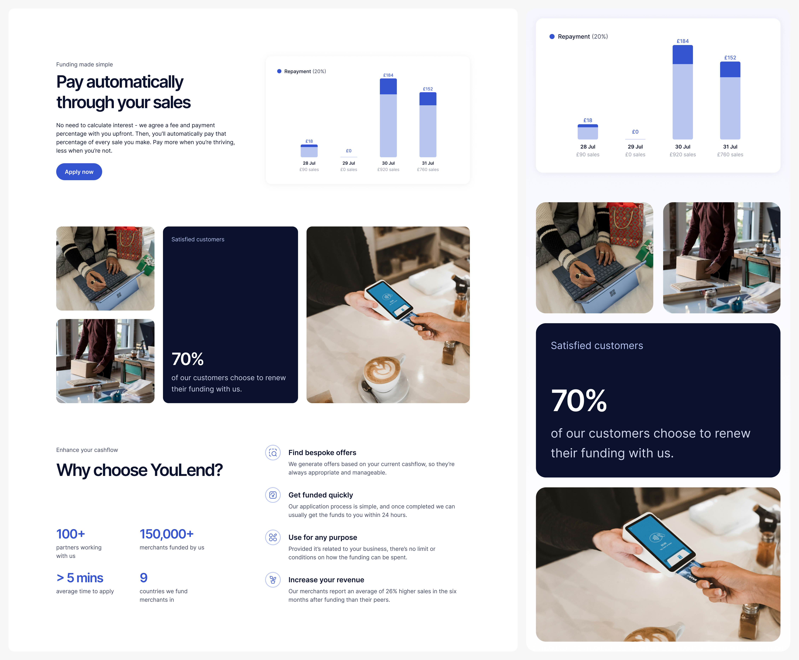

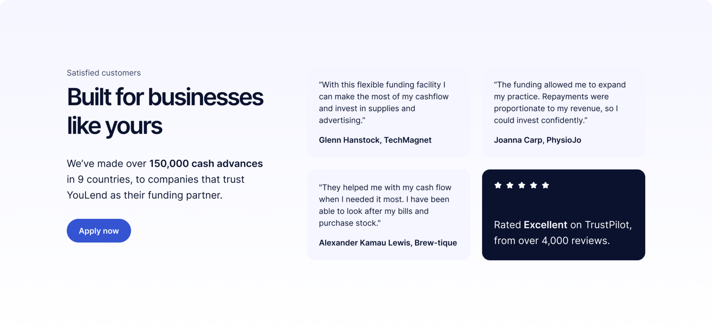

### Account creation

Simple modal to capture customer details. Initially our hypothesis was that this was causing the drop-off, but according to some previous team discovery into passwordless sign-up, customers who hadn’t entered these details upfront were less likely to convert.

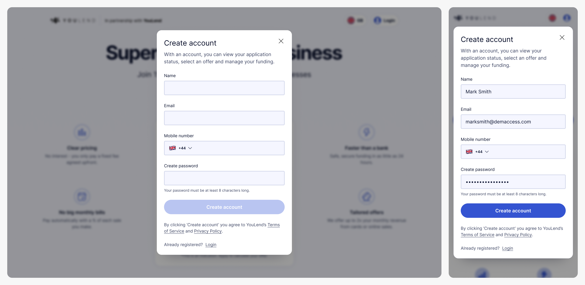

### Form design

As mentioned before, mobile optimisation was crucial to this project, which ended up informing the design a lot – beyond the Landing page, the majority of the screens are single-column forms, cutting out any complexity for responsive layouts.

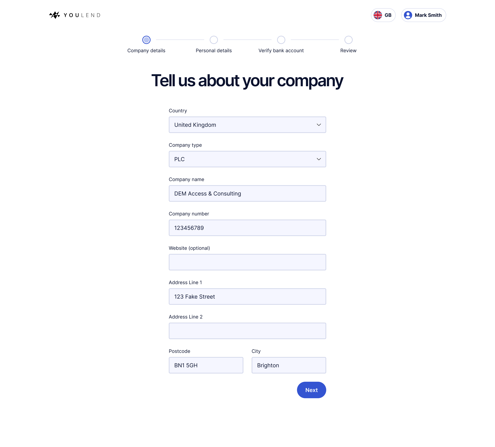

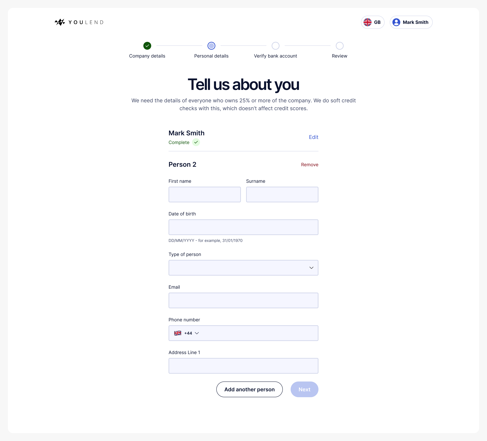

I looked to eCommerce UX principles to help streamline and guide the user – removing all navigation, providing a clear progress indicator and adding helpful copy, to explain _why_ we were asking for particular information.

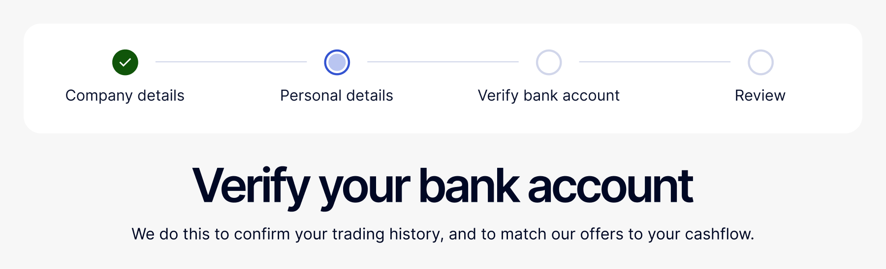

### Financial information

As the other significant drop-off, this page was a priority. The old design was uninspiring (see below left) and didn’t explain the Open Banking connection particularly well. Customers said it didn’t feel safe, and they didn’t understand what they had to do.

The new design prioritises the desired action, explains the reason plainly, provides social proof and some clear benefits to using this method over the manual upload, which is much more time-consuming and error-prone.

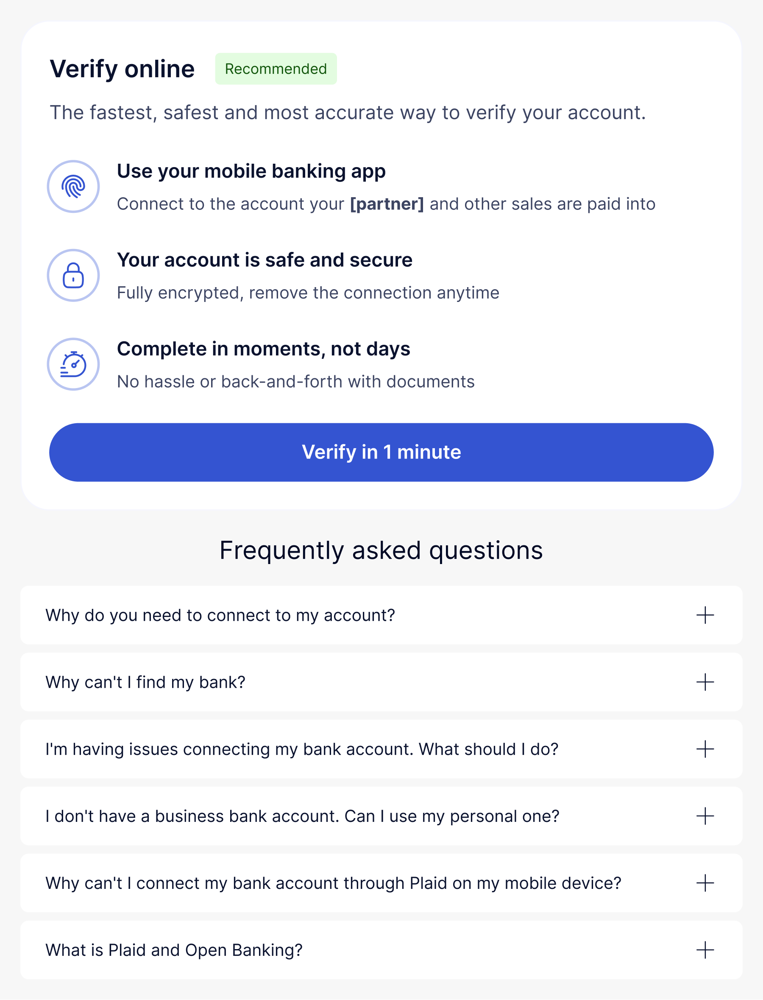

### Review

The old journey did feature a final ‘submit’ screen, but it was just a screen with a button on it; somewhere for customers to rejoin the flow if they left after completing the Open Banking connection.

It didn’t align with what customers would expect from a ‘final step’ in a sign up flow, so I created a Review screen where they could look back at their information and then Submit. This felt much more like the final step in the application, and provided much-needed affordance to fix any mistakes.

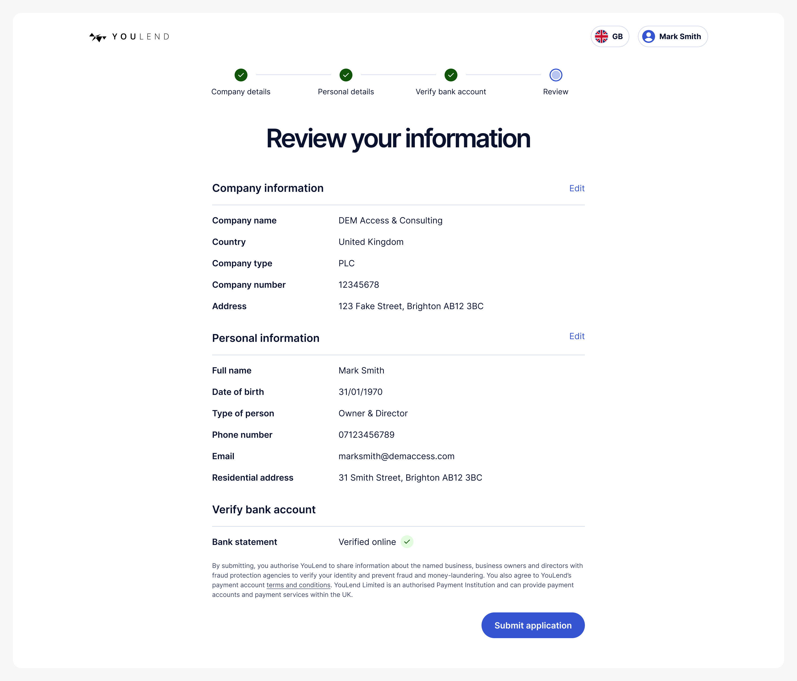

### Offers

Once the application is submitted and the customer has offers available, we send them to a screen where they can select the right offer amount, payment plan and fee.

As it’s one of the most important parts of the entire process, I emphasised interactivity, dynamic content and clear, easy-to-understand copy. I also included some contextual help content, rather than just relying on the FAQ section. These links, framed as questions, would open a simple modal to explain aspects of the product.

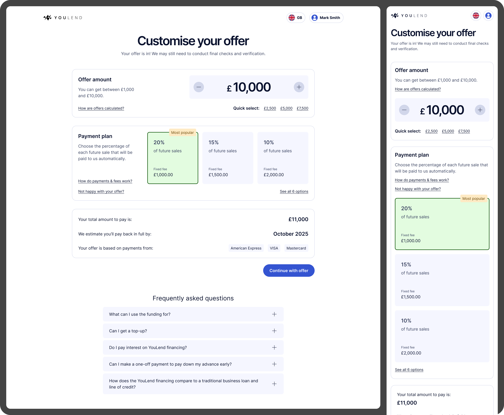

> That page looks really cool. The previous version was factually all there but visually, it didn’t inspire enough excitement. But this is really good, I like it.
>
> — Head of Product (Payments), Dojo

### Application status

Customer Support also told us that their most popular query was ‘what’s the latest on my application?’

To help reduce inbound call volumes, we created an application status page to explain how their application was progressing and if they needed to do anything to proceed.

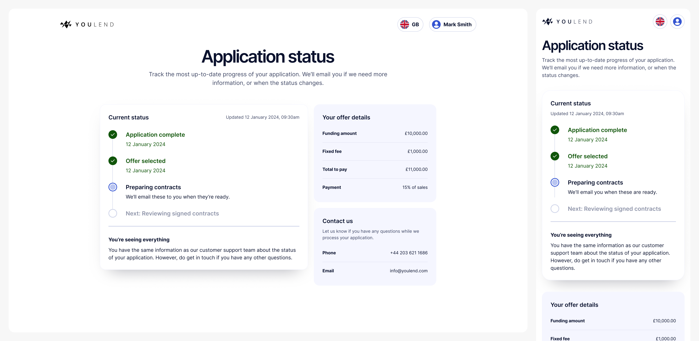

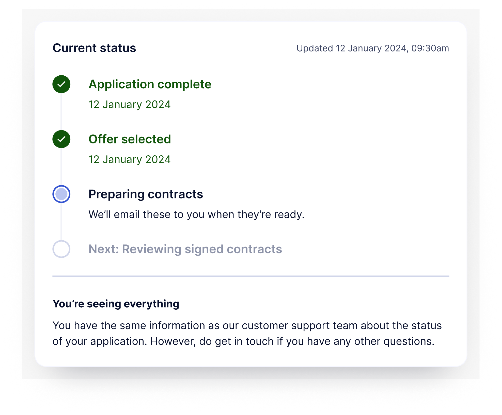

* * *

## Testing

I used Userbrain to conduct usability testing; overall the feedback was extremely positive, but had some useful pointers too.

> It’s very transparent and clear, no difficulty in understanding what I’m needing to do.

> ‘Type of person’ sounds very awkward, could that be ‘role’ or something else?

> Deciding on the percentage is going to slow me down slightly

> I would do my research on YouLend first, make sure people are happy – check TrustPilot and things like that

> Incredibly clear, everything is laid out in a way where it’s easy to fill out the information, but also I understand each process and why my information is needed

> I think [the instructions] were really clear, I never had a moment where I didn’t know what I needed to do next. I did sometimes want to read text again but the instructions were very clear in terms of what to do.

> Just clarify who you’re verifying with, is it YouLend or someone else

* * *

## Challenges

### Product complexity

Discussions with the wider stakeholder group revealed edge cases we hadn’t been aware of. For example, when presenting offers to the customer, we could potentially have a range of payment plans from 5-30%, incremented at 0.5% intervals. This meant we had to decide on an appropriate number to show the customer – listing 50+ options would just be ridiculous – and a way of further focusing on the most viable options, to avoid decision paralysis.

### Localisation

YouLend operates in nine countries internationally, so everything from UI to contracts needs to be translated into French, Polish, Dutch, German and Spanish.

Varying word/sentence lengths can cause issues, so I designed everything with the potential for wrapping in mind, to ensure it didn’t break anything.

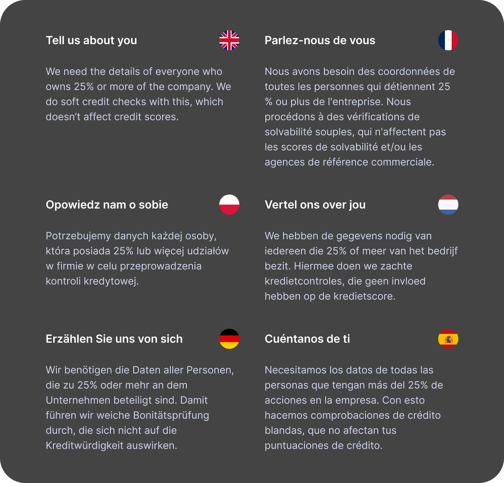

Maintaining tone-of-voice is also difficult when you’re not in control of the output. Yvonne and I worked on the copy in English, used DeepL to provide a first-draft translation and then asked native speakers within the company to double-check their respective languages.

All teams have to follow this process – it’s a bottleneck for every team, and without dedicated bilingual copywriters who can own the TOV for each language, there’s often disagreement on what the ‘correct’ translation is.

* * *

## Results

At the time of writing (November 2024) the new journey is being rolled out to all partners – there is some account management/comms to consider as some partners weren’t happy to migrate without understanding the impact, which is fair.

I’ve personally led sessions with product/design teams at eBay, Amazon, Booking.com, Dojo and Mollie Capital to demo the flow to them. Everyone so far has been impressed with the redesign, and deems it a significant improvement over the previous one.

### Numbers

<StatGrid>
  <StatTile value="83%">initial conversion uplift</StatTile>
  <StatTile value="7%">increase in Open Banking connections</StatTile>
  <StatTile value="55%">reduction in customer service calls about application status</StatTile>
  <StatTile value="10%">conversion uplift on average</StatTile>
</StatGrid>

It’s early days – we’re monitoring the performance in LaunchDarkly and day-by-day the new journey is definitely outperforming the old one, up to 20% in some cases.

For the application status page, in the first month after launch we saw a 55% decrease in customer service calls related to this topic, which is amazing to see.

I will update with more definitive results in a few months, as well as some insights on the expected commercial uplift.

* * *

## Credits

**My role**  
Design Lead

**Tools used**  
Figma  
Userbrain  
Figjam  
Miro  
LaunchDarkly  
Heap

**Date**  
Spring/summer 2024

**Team**  
Yvonne Regan, Senior Product Manager  
Jessica O’Hare, VP Product
