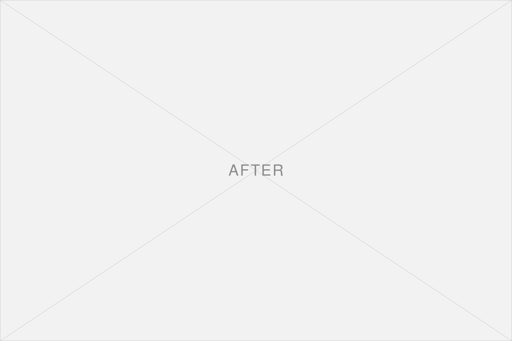
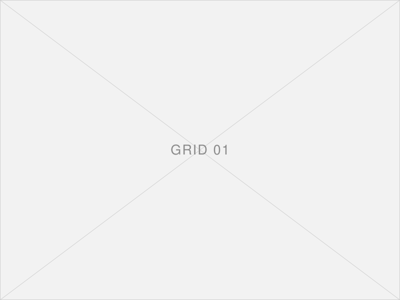
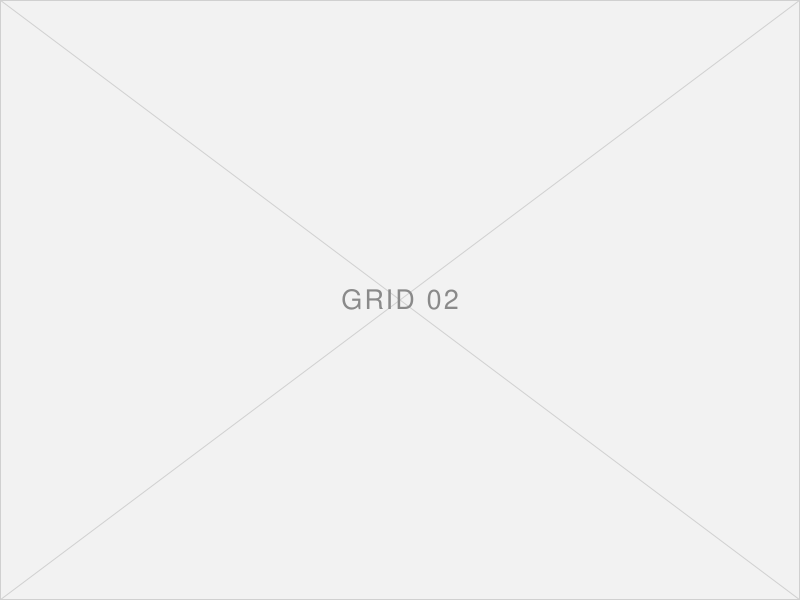
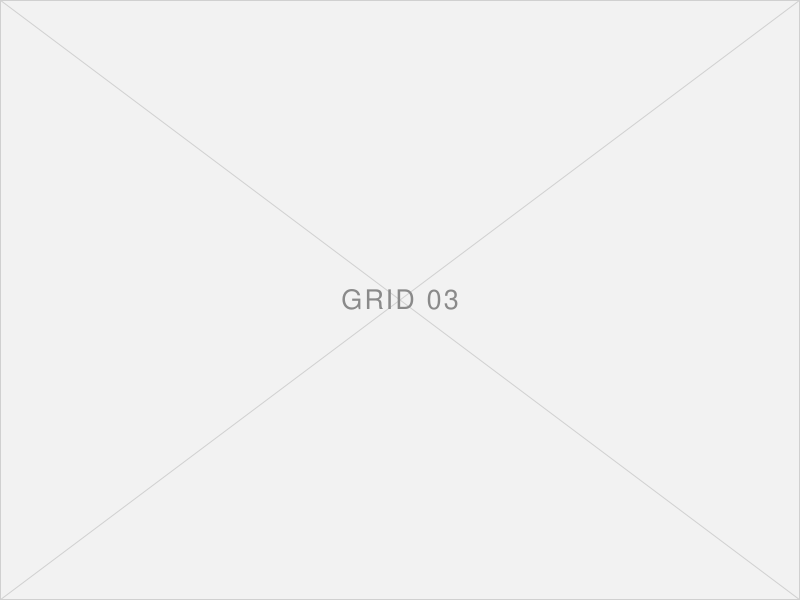
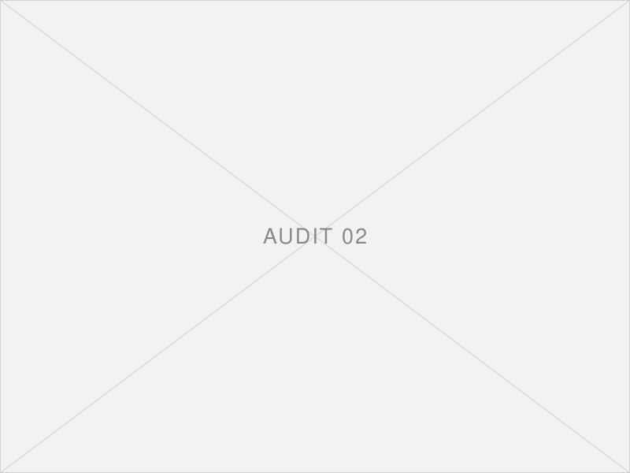

import Section from '../../components/Section.astro';
import Lead from '../../components/Lead.astro';
import LabelledBlock from '../../components/LabelledBlock.astro';
import PullQuote from '../../components/PullQuote.astro';
import QuoteStack from '../../components/QuoteStack.astro';
import StatGrid from '../../components/StatGrid.astro';
import StatTile from '../../components/StatTile.astro';
import Figure from '../../components/Figure.astro';
import ImageGrid from '../../components/ImageGrid.astro';
import BeforeAfter from '../../components/BeforeAfter.astro';
import Journey from '../../components/Journey.astro';
import Stage from '../../components/Stage.astro';
import CardGrid from '../../components/CardGrid.astro';
import Card from '../../components/Card.astro';
import Credits from '../../components/Credits.astro';

<Section number="01" title="Context">

<Lead>

This page renders every case-study component in its real context — inside
`ProjectLayout` and a `<Section>` label-column layout — so you can see what's
available before you write your own study. It has an [inline link](/work).
Open `src/content/projects/component-showcase.mdx` in your editor and copy
whichever blocks you need.

</Lead>

<LabelledBlock label="The Brief">

Redesign the core checkout flow, delivering a seamless experience for
returning customers. Body copy can contain **bold**, _emphasis_, `code`, and
[links](/about).

</LabelledBlock>

<LabelledBlock label="The Challenge">

Consolidate several fragmented, legacy flows into a single dynamic journey
that handles edge cases without adding friction for the common path.

</LabelledBlock>

<LabelledBlock label="The Outcome">

Streamlined the core experience to reduce cognitive load and error rates.

</LabelledBlock>

</Section>

<Section number="02" title="Discovery">

### A subsection heading (H3)

Ordinary body paragraph for baseline comparison. Use this level for prose that
sits directly in a section without its own component. A bulleted list
follows:

- First point in a normal markdown list
- Second point, a little longer so it wraps onto a second line at the prose measure
- Third point

And a numbered list:

1. Step one
2. Step two
3. Step three

A `.statement-list` for pulled points:

<ul class="statement-list">
  <li>Separating long-term behaviour from short-term fads</li>
  <li>Mastering strict information hierarchy</li>
</ul>

</Section>

<Section number="03" title="Stats">

#### Single stat

<StatGrid columns={1}>
  <StatTile value="£24m">annual value identified during discovery</StatTile>
</StatGrid>

#### Two / three / four up

<StatGrid columns={2}>
  <StatTile value="50%">found the old flow confusing</StatTile>
  <StatTile value="27%">wanted clearer terms up front</StatTile>
</StatGrid>

<StatGrid columns={3}>
  <StatTile value="94%">interacted with the design system often</StatTile>
  <StatTile value="49%">knew the component update process</StatTile>
  <StatTile value="88%">felt its purpose was clear</StatTile>
</StatGrid>

<StatGrid columns={4}>
  <StatTile value="83%">initial conversion uplift</StatTile>
  <StatTile value="7%">more accounts connected</StatTile>
  <StatTile value="55%">fewer support calls</StatTile>
  <StatTile value="10–20%">uplift by segment</StatTile>
</StatGrid>

</Section>

<Section number="04" title="Quotes">

<PullQuote>

For people who need to get a task done and move on, this flow is built to
evolve alongside whatever they throw at it.

</PullQuote>

<PullQuote cite="Head of Product" role="A fictional company">

That page looks really cool. The previous version was factually all there but
visually it didn't inspire enough confidence.

</PullQuote>

<QuoteStack>

> “It's very transparent and clear, no difficulty understanding what I need to do.”

> “That label sounds very awkward — could it be something else?”

> “Deciding on the percentage is going to slow me down slightly.”

> “I'd do my own research first — check reviews and things like that.”

> “Incredibly clear, everything is laid out in a way that's easy to fill out.”

</QuoteStack>

</Section>

<Section number="05" title="Imagery">

<Figure caption="A prose-width figure — inline with the text column." width="prose">

</Figure>

<Figure caption="A wide figure — fills the full section width.">

</Figure>

<BeforeAfter beforeLabel="Before" afterLabel="After">
<Fragment slot="before">

</Fragment>
<Fragment slot="after">

</Fragment>
</BeforeAfter>

<BeforeAfter beforeLabel="Before" afterLabel="After" mode="split">
<Fragment slot="before">

</Fragment>
<Fragment slot="after">

</Fragment>
</BeforeAfter>

<ImageGrid cols={3}>

</ImageGrid>

<ImageGrid cols={2} caption="A two-up grid with a caption.">

</ImageGrid>

</Section>

<Section number="06" title="Journey">

Icon → title → subtitle stages, no background, sitting in the prose column.

<Journey columns={3}>

<Stage title="Time estimates">
<Fragment slot="icon">

</Fragment>

4 weeks of discovery, 8 weeks of design, split into 4×2-week blocks.

</Stage>

<Stage title="Plan of action">
<Fragment slot="icon">

</Fragment>

Catalogued, categorised by function, then prioritised into the blocks.

</Stage>

<Stage title="Governance">
<Fragment slot="icon">

</Fragment>

Specific objectives for success and a RACI for all stakeholders.

</Stage>

</Journey>

</Section>

<Section eyebrow="Blocks" title="Cards">

A bordered card with every part optional — icon, title, body, footer. Below:
title + body + footer, icon + title + body, icon + body (no title), title + body.

<CardGrid columns={2}>

<Card title="Recipients">

Of payments by active customers, 46% went to one of the last three recipients.

<Fragment slot="footer">

**Idea:** Provide a "Recent" section in the recipients list.

</Fragment>

</Card>

<Card title="Repeated actions">
<Fragment slot="icon">

</Fragment>

65% of scheduled actions were "do once" and "tomorrow".

</Card>

<Card>
<Fragment slot="icon">

</Fragment>

This flow should become the gold standard for the rest of the product.

</Card>

<Card title="Track">

Monitor progress against the goal and surface the next best action.

</Card>

</CardGrid>

</Section>

<Section title="Credits">

<Credits
  role="Design / Strategic Lead"
  tools={["Figma", "Figjam", "Zeroheight", "Confluence"]}
  date="Spring 2025 – Winter 2025"
  team={[
    "Jordan Lee, Lead UI Designer",
    "Sam Patel, Head of Product Design",
    "Taylor Reed, Product Designer",
    "Morgan Blake, UX Writer",
  ]}
/>

</Section>
