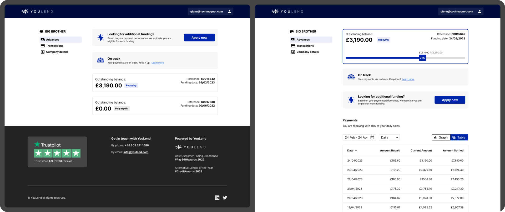
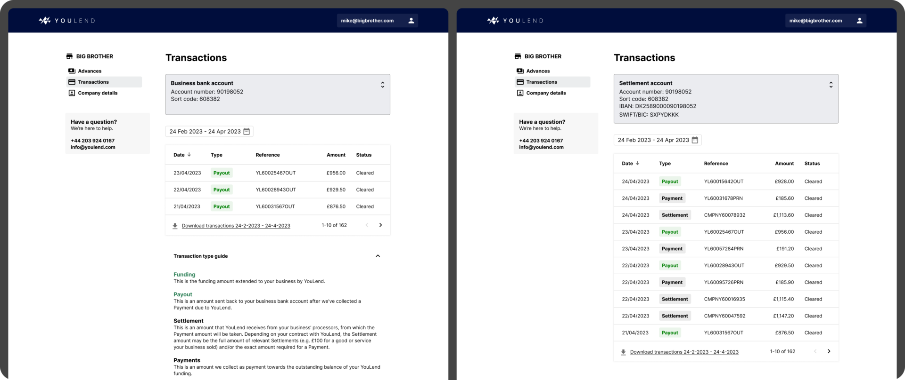
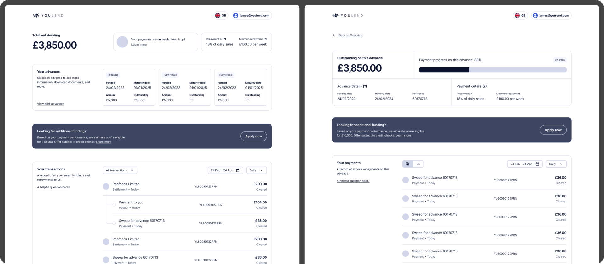
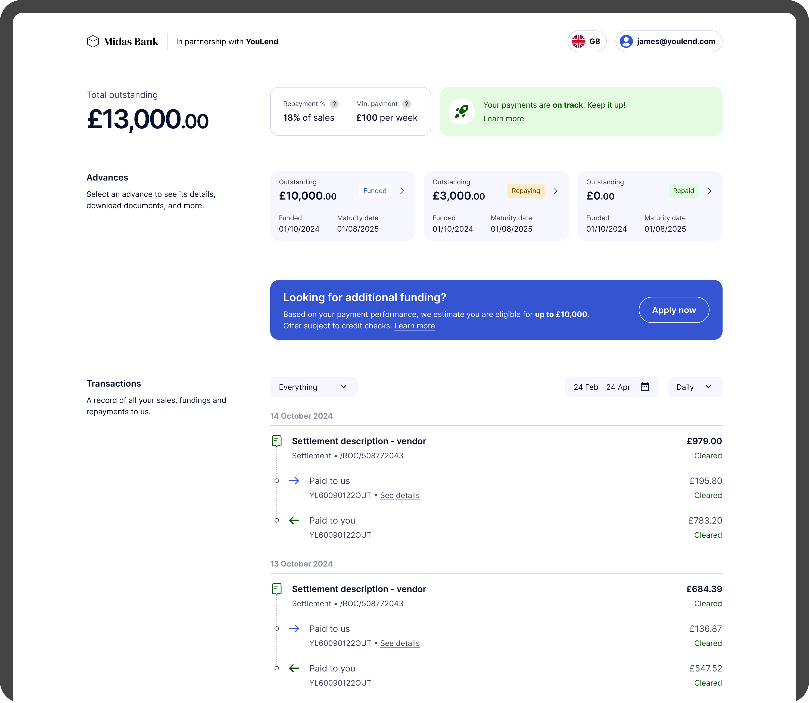
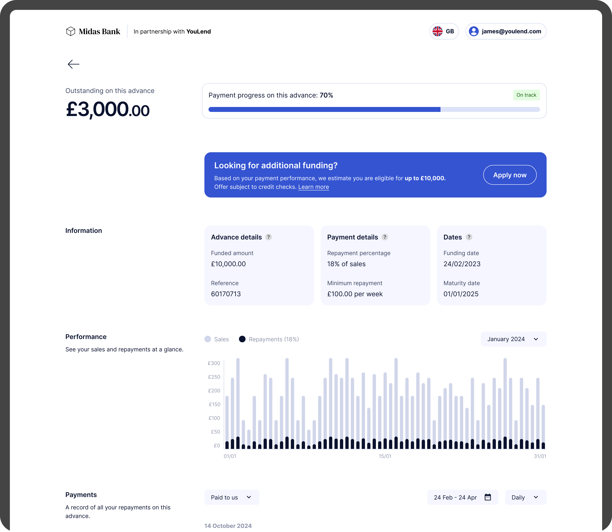
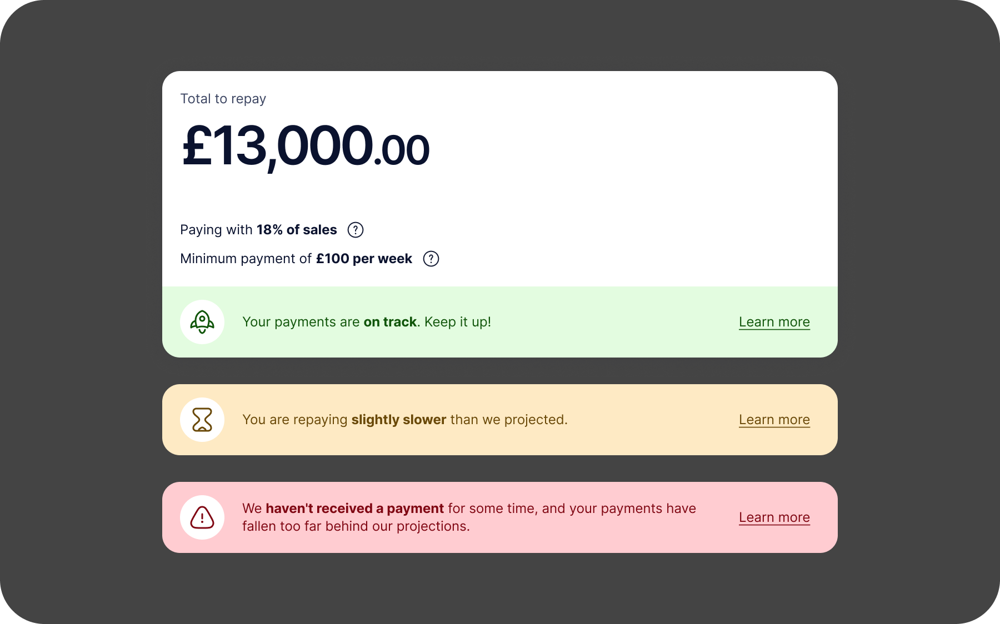
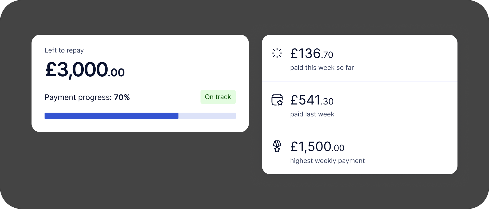
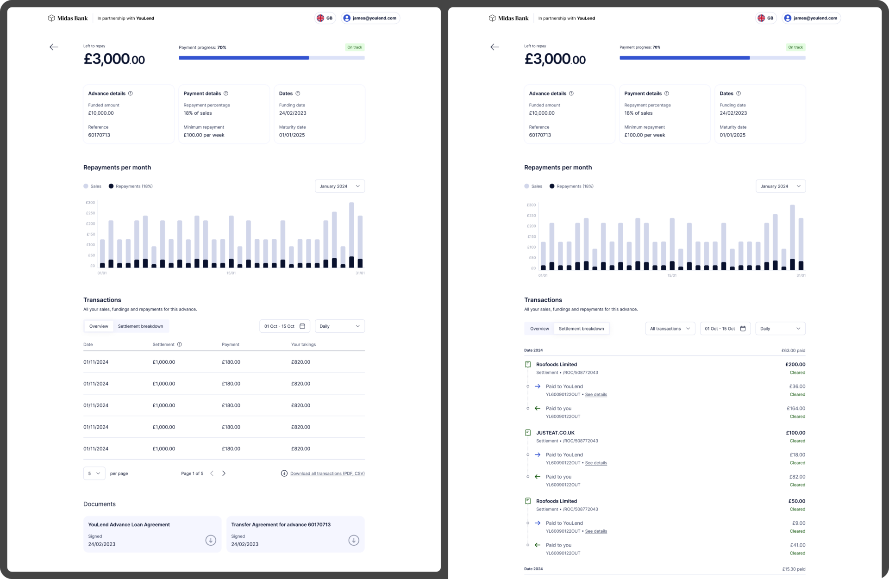
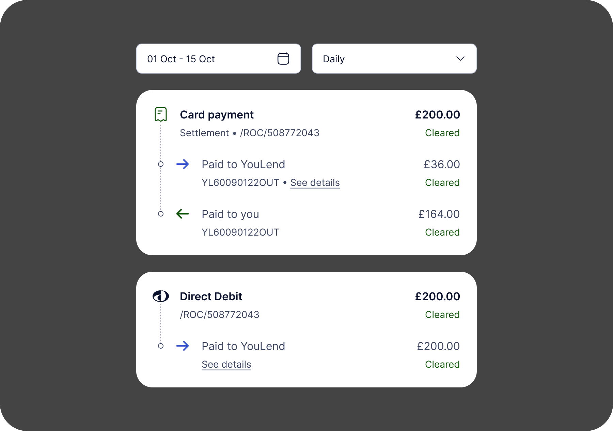
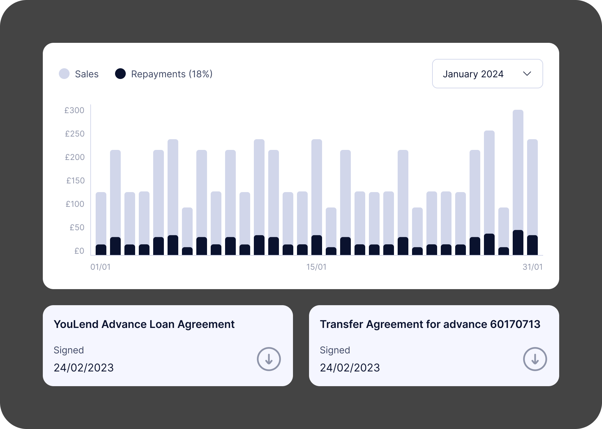

import StatTile from '../../components/StatTile.astro';
import StatGrid from '../../components/StatGrid.astro';

## Context

### The Brief

Build a scalable servicing platform for YouLend merchants to monitor funding offers, real-time repayments, and account health.

### The Architectural Challenge

Organising dense financial data, multi-variable underwriting parameters, and complex repayment schedules into intuitive, self-service dashboards.

### The Operational Win

Aimed to deliver a modular dashboard framework that reduced customer support queries and gave partners clear, real-time visibility over their loan portfolios.

* * *

## Research & Discovery

### Part 1: Payment reconciliation

Customers using the merchant dashboard to reconcile payments and pinpoint exactly where “settlement” amounts are coming from found it difficult to locate and use this information, resulting in a significant amount of Customer Support calls.

### Part 2: Visibility of payment terms

Customers who fall behind our projected rate of repayment enter a Collections state and are contacted by our support teams to get back on track.

Often, these customers are surprised to hear that they’re behind, because they were unaware of the conditions they had to abide by – they are mentioned in their initial contract, but nowhere else.

It creates a stressful experience for them, and we lose almost 20% of renewals from customers in Collections compared with those who aren’t.

The team estimated that by closing 80% of the gap between renewal rates of merchants in Collections and those who aren’t, we could increase our funded amount by £24m per year, which equals £2.4m per year of gross revenue.

### Survey

Nicole kicked off by putting out a survey to current dashboard customers via Hotjar.

She found that:

Customers mostly visit the dashboard to check their current balance, or to review recent transactions/payments

They generally like the dashboard, rating it 4.2/5 when asked ‘how easy is it to complete your tasks?’

When asked _‘What’s one thing you would improve about the dashboard?’_:

<StatGrid>
  <StatTile value="50%">wanted better options for renewing their funding, or viewing offers</StatTile>
  <StatTile value="27%">wanted better projections of how they are repaying over time</StatTile>
  <StatTile value="12%">wanted more clarity in the statements and graphs included in the dashboard</StatTile>
</StatGrid>

### Customer Support

We listened to customer call recordings, and spoke with a CS team lead to confirm these findings, and to get a sense of their most popular questions.

About 5% of CS calls were dashboard-related:

*   Reconciling & understanding payments/transactions
*   Password management
*   Locating important documentation (e.g. contracts)

Interestingly, all of this functionality exists within the current dashboard. Customers just weren’t able to locate or use the features, due to poor UX.

### Analysis of current designs

The make-up of the current dashboard is fairly basic:

#### Overview + Advance details

Select your advance, view balance, see recent aggregated payments, see payment performance, view contracts

#### Transactions

Reconcile individual transactions, download spreadsheets of transaction data, see account details

#### Company details

See your saved company info and contact information

#### Renewals

If eligible (usually once current advance is 80% paid off), apply for additional funding

### Overview + Advance Details (deep dive)

This is the ‘homepage’ of the dashboard.

*   The main content column is small – only 650px wide
*   When customers first join, Advance Details (above right) is their first screen. Once they renew, they’re given the Overview screen (above left), which allows them to select one of their advances, showing them the respective Advance Details screen
    *   This is awkward from a development perspective and forces the user to relearn the experience after renewal with no warning, all just to save one click for customers who haven’t renewed. Around 70% of our customers _do_ renew, so it feels unnecessary
*   When viewing the Payments section, despite the default view being the Graph, most customers immediately switch to the Table view as the Graph isn’t useful
    *   The narrow column, and default timescale of ‘all time’ leads to a very zoomed-out graph where it’s difficult to discern anything of value
*   Neither page features the information customers need to avoid Collections

### Transactions (deep dive)

This page features tables of transactions, organised by ‘Business bank account’ (the customer’s bank account) or ‘Settlement account’ (the account we open for them, where their payments go)

*   This page is where Transaction reconciliation should happen, but few people find it
*   Those that do are left confused by what they see – it’s not immediately obvious what the table is telling them, and some key information is being left out
*   The ‘Settlement account’ page contains the most useful information but is hidden behind a click (and the dropdown to select it doesn’t feel very interactive)
*   The copy is inefficient – we use jargon to label the transactions, and then over 120 words to explain the labels

* * *

## Design

### Wireframes + early concepts

I put these together so that Nicole and I could discuss changes to the designs, mainly IA. Main things to note:

*   Removed the sidebar – navigation was now a ‘hub-and-spoke’ shape with the Overview page at the centre, clicking into Advance Details, and then Back again
*   Incorporating all detailed transaction information in a feed on the Overview page, to allow quick access for those wanting to do reconciliation
*   Clear renewal banners for eligible customers
*   Incorporated payment terms and performance into the page header
*   Redesigned the transactions as a timeline, more akin to a banking app
    *   I removed the jargon and added a more visual connection between the gross sale, money repaid, and money out

I demoed these to the tech leads in the team, with Nicole also providing context, to bring engineering on-board as soon as we could.

After several rounds of iteration we settled on a direction, and I then worked these up further into a high-fidelity prototype, so that we could do some user testing.

### Testing: User interviews

We spoke with six YouLend merchants that had logged in at least twice in the last 30 days, to get a sense of how they use the dashboard currently, how they feel about it. The insights we got aligned with what we found in our initial discovery, which was really great to see.

### Use cases

#### Repayment tracking & business monitoring

Users primarily log in to view outstanding balances, repayment percentages, and daily repayment amounts

#### Renewal applications

Participants occasionally use the dashboard to explore eligibility for new funding

#### Reconciliation

Many participants compare gross sales and repayment data with internal records or EPOS systems

#### Financial reporting

Participants download data and agreements for VAT submissions or tax filings

### Pain points

#### Lack of detailed performance metrics

Users want to know if they are ahead or behind on repayment schedules, and by how much, rather than only seeing ‘on-track’

#### Limited visibility into transactions

The breakdown of gross sales, repayments, and net settlements is not easily accessible without downloading data

#### Clunky renewal process

While generally easy, the renewal flow is inconsistent. Some users prefer to email their account manager rather than use the dashboard

#### Mobile compatibility

Some users experience blank screens or difficulty accessing features on older mobile devices

### Testing: Moderated usability testing

After the interview section, I shared the prototype with the participants, and then set some simple tasks to do, such as identify your current balance, see how much you repaid on a given day, and find where you would download the contract for a specific advance.

Overall the sentiment was positive – users appreciated the consolidated layout, making it easier to access key metrics at a glance. The clear display of gross sales, repayment deductions, and net settlements was highly praised, and seeing the percentage repaid and projected payoff date seemed to resonate well.

### Things to improve

Aside from bringing back more detailed ahead/behind information, participants didn’t find the granular transaction view that helpful.

While they agreed it was clearer than the current dashboard, it didn’t match their main use case of quickly logging in to check the balance and recent sales.

They much preferred an aggregated view of the day’s or week’s numbers for that – if they need to dig into the details, they can do that separately.

### Finalised designs

#### Overview

I reworked the designs again, to address the above and to refine the layout further. I sat everything in a single column and re-introduced tables to provide the summary views.

‘Motivational’ was an often-used word by participants so I added more data near the top to show current performance this week, compared to last week, and the best all-time week.

#### Advance details

Key information about the advance is shown at the top, as well as a reworking of the graph and the transaction detail panel, which can be switched from a summary to the detailed timeline.

## Complexities

At its heart, YouLend’s Merchant Cash Advance is a complex product. Aside from the nine countries we’re present in, each with varying rules to abide by, not to mention the six languages we use, we also have to account for:

*   Different rules for limited companies vs sole traders
*   Three different main payment methods: re-routing, Direct Debit (fixed or variable) and SBR, or sales-based repayments. These all need to be depicted in the above style
*   Potential for multiple settlement accounts for re-routing customers, and also multiple business bank accounts
*   YouLend may further split its take into repayments for multiple lenders, which we have to break down for regulatory reasons, although customers typically don’t care about this

The design is flexible and scalable enough to cater for these variations, some of which are thankfully quite narrow edge cases.

* * *

## Next steps

At the time of writing (December 2024) the design phase is now complete. We’re currently working with legal to ensure everything we’ve done is compliant, and we will also need to produce localised versions of the dashboard for all geographies. The build will begin in Q1 2025.

* * *

## Credits

**My role**  
Design Lead

**Tools used**  
Figma  
Userbrain  
Figjam  
Miro  
Heap

**Date**  
Autumn/winter 2024

**Team**  
Nicole Ng, Product Manager
