import Section from '../../components/Section.astro';
import LabelledBlock from '../../components/LabelledBlock.astro';
import StatTile from '../../components/StatTile.astro';
import StatGrid from '../../components/StatGrid.astro';
import Figure from '../../components/Figure.astro';
import ImageGrid from '../../components/ImageGrid.astro';
import Journey from '../../components/Journey.astro';
import Stage from '../../components/Stage.astro';
import CardGrid from '../../components/CardGrid.astro';
import Card from '../../components/Card.astro';
import Credits from '../../components/Credits.astro';

<Section number="01" title="Context">

<LabelledBlock label="Problem">

In 2022, there were over 18m people in the UK with £10,000 or more in low-interest savings or current accounts.

We believed that these people would benefit from financial advice, a service largely misunderstood and mistrusted by the general public.

</LabelledBlock>

<LabelledBlock label="Solution">

If we could provide free, quality financial advice for all Moneybox customers, that would be a significant disruptor in the UK savings & investments market.

To test the idea, we created a service designed to help Lifetime ISA customers create a holistic savings goal for their first home. This was chosen for its commercial potential; revenue and x-sell are key metrics in the CX mission.

</LabelledBlock>

</Section>

<Section number="02" title="Research & Discovery">

### Prior efforts

The team had already completed some research prior to me joining the company – a competitor analysis, survey, and some initial prototypes which they had tested with customers. They found that:

<CardGrid columns={2}>

<Card>
<Fragment slot="icon">

</Fragment>

Low numbers had received financial advice

</Card>

<Card>
<Fragment slot="icon">

</Fragment>

The most sought-after features included: recommended accounts, goal tracking, and financial coaching

</Card>

<Card>
<Fragment slot="icon">

</Fragment>

Those that hadn’t received advice were mostly in their 20s, and only had cash savings, very few investments

</Card>

<Card>
<Fragment slot="icon">

</Fragment>

Most-wanted guidance: ‘how to invest’, ‘save my money’, ‘create an investment strategy’

</Card>

</CardGrid>

All signs pointed to yes – this feature would serve as an MVP of the wider ‘financial goals’ concept, with a view to rolling out a more updated experience across the entire app.

The decision was also made to target potential homebuyers (Lifetime ISA customers), because of the commercial potential.

</Section>

<Section number="03" title="User journey">

The home-buying feature was split into four parts:

<Journey columns={4}>

<Stage title="Fact-find">
<Fragment slot="icon">

</Fragment>

Understand the customer’s current financial situation. Enter salary, location, timeframe, solo/with partner

</Stage>

<Stage title="Customise">
<Fragment slot="icon">

</Fragment>

Add more details to get the most accurate savings figure. Select deposit %, additional fees, savings level

</Stage>

<Stage title="Cross-sell">
<Fragment slot="icon">

</Fragment>

Save for non-deposit items – survey, moving, stamp duty. Choose from available savings accounts

</Stage>

<Stage title="Track">
<Fragment slot="icon">

</Fragment>

Monitor savings progress over time, and access other resources. View currently saved, overall target, account breakdown, other tools

</Stage>

</Journey>

</Section>

<Section number="04" title="Design">

I started mapping out the flow as wireframes to ensure it all made sense; once we were happy with it, I created high-res versions of the screens. I leaned into our design system components as much as possible, even reusing existing illustrations to reduce overhead.

Where custom UI was needed, I liaised with our developers to ensure requirements were clear. I also conducted design QA during product review.

### Fact-find

Simple, continuously-scrolling form. This was an existing pattern within the app which made development straightforward, although it did limit the types of questions we could ask and information we could display.

<ImageGrid cols={2} width="prose">

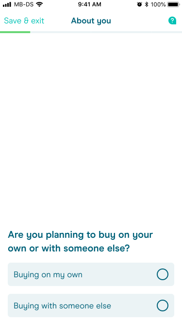
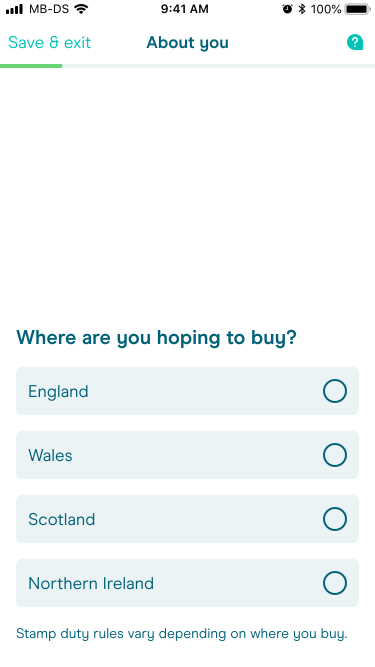
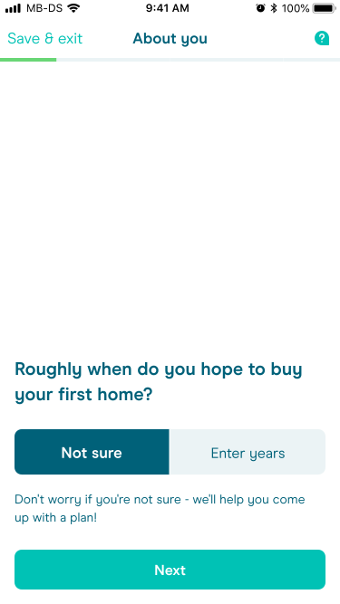
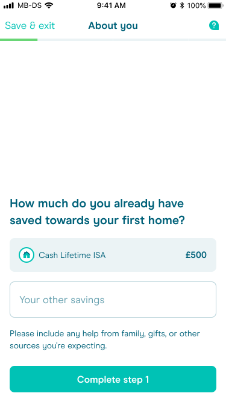

</ImageGrid>

### Customise

Customers receive their basic target value from the fact-find, and use a number of controls to fine-tune it.

<ImageGrid cols={2} width="prose">

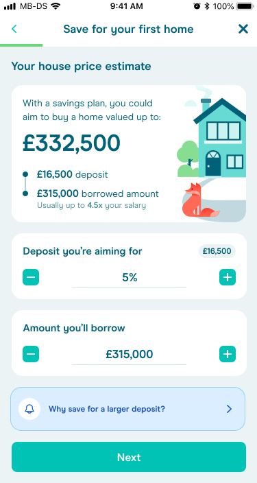
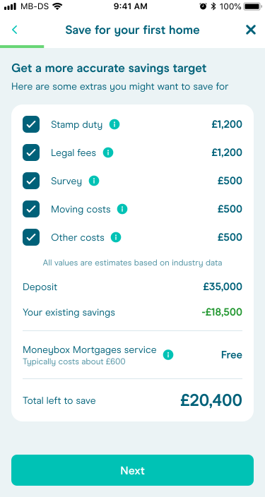
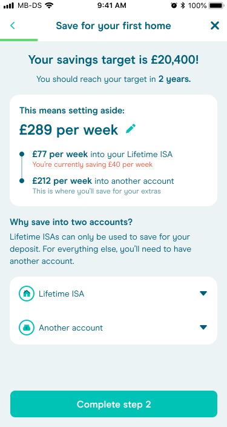
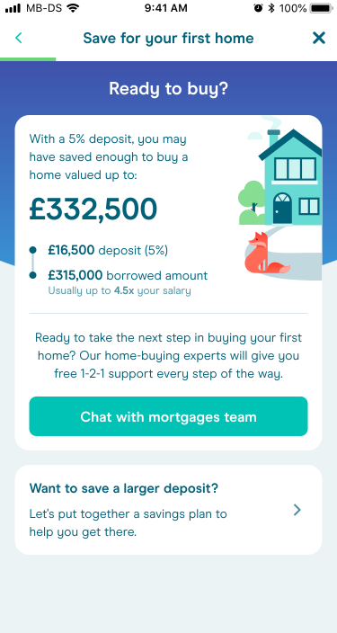

</ImageGrid>

### Cross-sell

Lifetime ISAs can only be used for a house deposit. Everything else, such as a survey, moving costs, stamp duty, will need to be saved for elsewhere.

This part of the feature allows Lifetime ISA customers to open a second account for these items and decide how to allocate their savings.

<ImageGrid cols={3} width="prose">

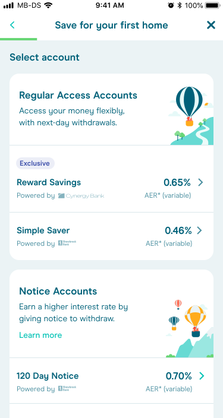
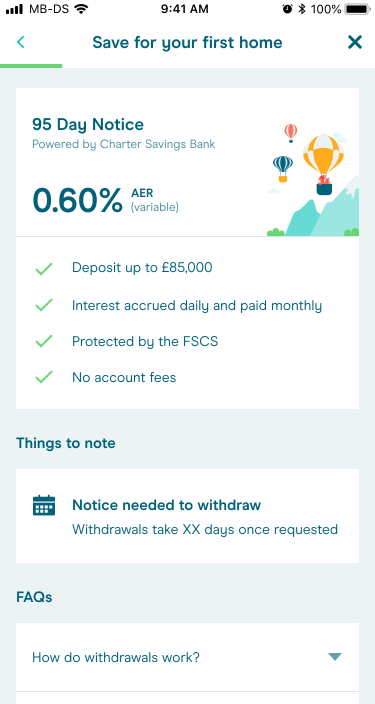
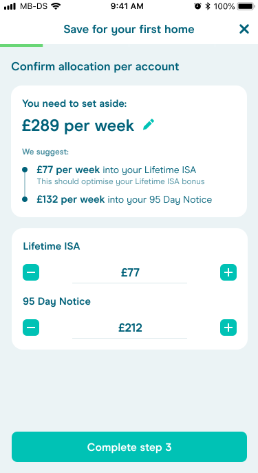

</ImageGrid>

### Track

Once finished, the Tracking screen is their ‘hub’ where they can view progress, update their savings amounts and access other related tools.

<ImageGrid cols={2} width="prose">

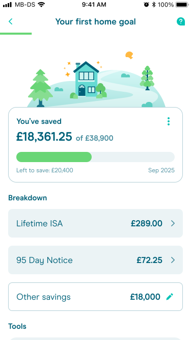
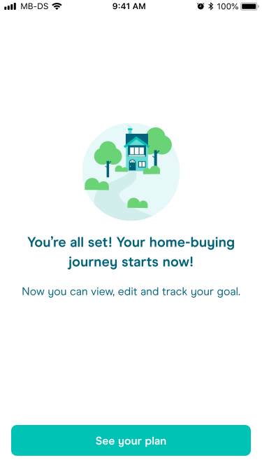

</ImageGrid>

### Further exploration

I also explored other ideas such as interstitial screens to break up the flow and prime the user for the next section; and milestones to make the target feel more achievable over long time periods.

<ImageGrid cols={3} width="prose">

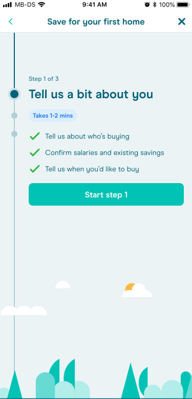
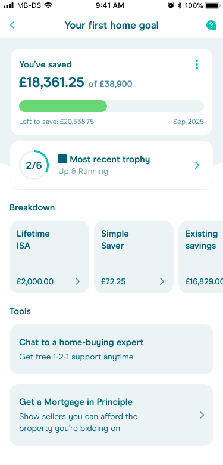
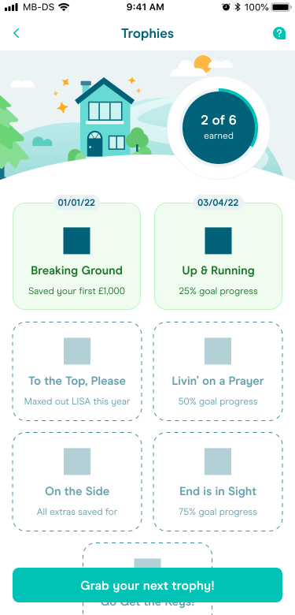

</ImageGrid>

</Section>

<Section number="05" title="Conclusion">

The feature saw some early positive success – test participants reported that it was an innovative and useful feature, bringing to light aspects of home-buying they hadn’t considered previously.

<StatGrid columns={4}>
  <StatTile value="51%">engagement with initial comms (company benchmark of 10%)</StatTile>
  <StatTile value="10%">made positive contributions to their savings through the feature</StatTile>
  <StatTile value="49%">engagement with the home-buying goal feature</StatTile>
  <StatTile value="4%">contacted our mortgages team to discuss buying a home</StatTile>
</StatGrid>

### Personal learnings

Despite the project’s initial success, it also showed the value of a tight, well-defined MVP. The business chose this feature because of its revenue potential, but the complexity meant months of ideation, design and build.

As a proof-of-concept, it may have been better to start smaller e.g. savings pots, and enrich it over time with customisation options, ability to share goals with others etc.

Had the brief aimed to solve a customer problem rather than a business one, we could have created a real differentiator.

</Section>

<Section title="Credits">

<Credits
  role="Design Lead"
  tools={["Figma", "Figjam", "Attest", "Usertesting.com"]}
  date="Apr–Oct 2022"
  team={[
    "Eden Fish, Product Designer",
    "Karl Koch, Product Designer",
    "Harry Boteler, Product Manager",
    "Victoria Palmer, Senior Product Manager",
    "Smith Forte, Chief Product Officer",
  ]}
/>

</Section>
