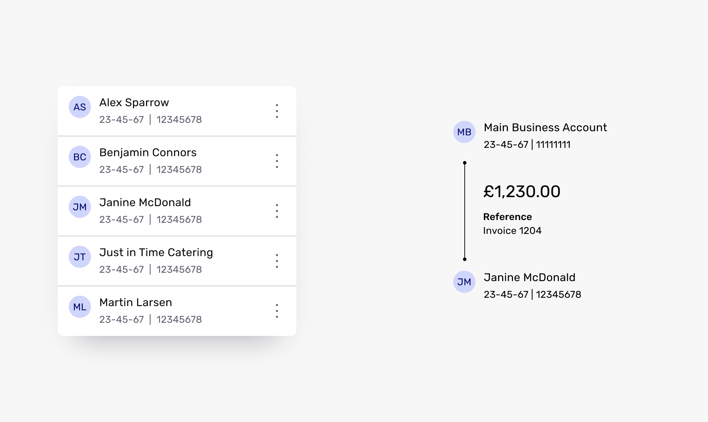
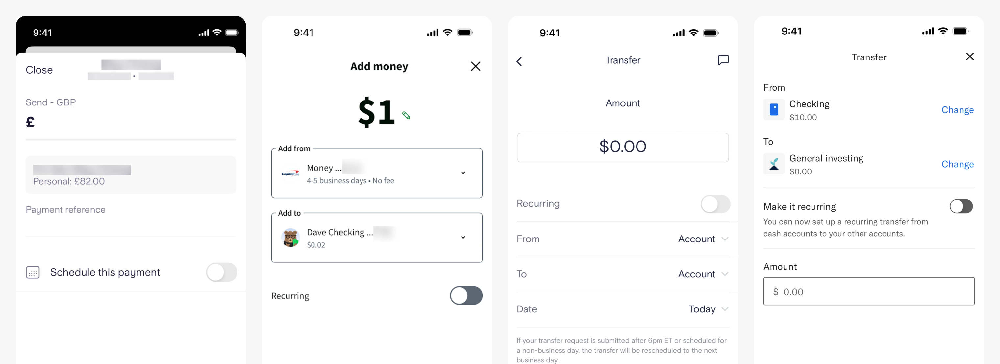
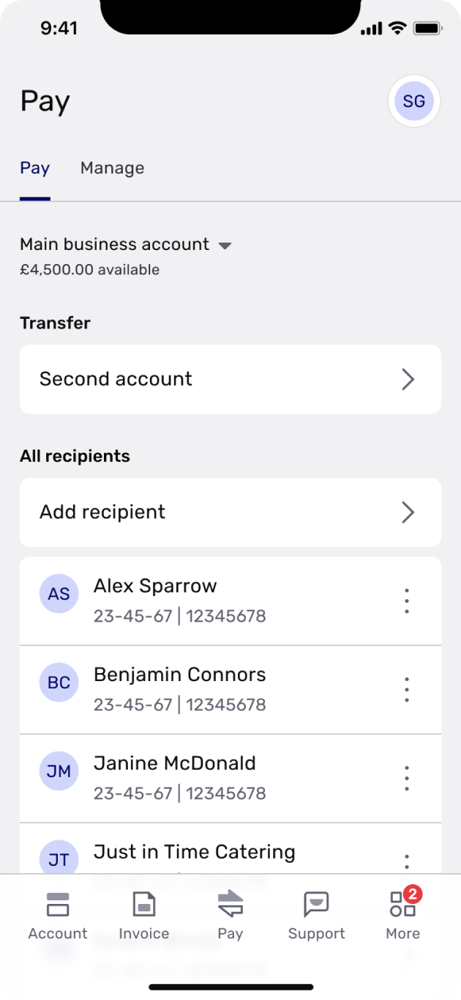
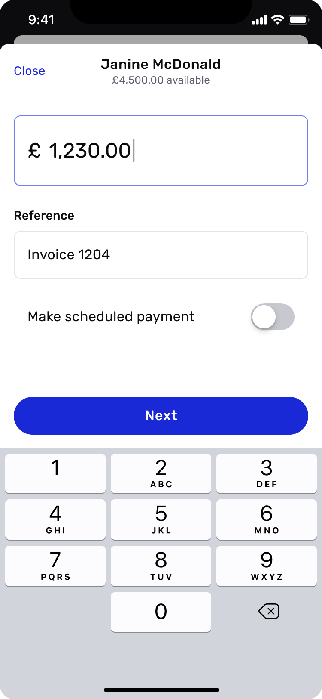
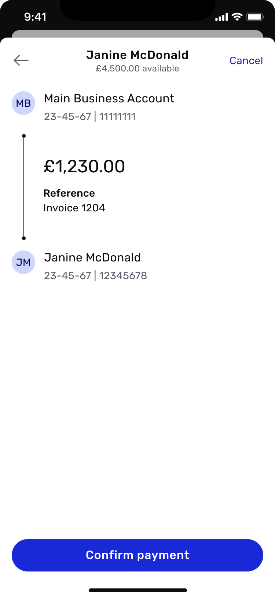
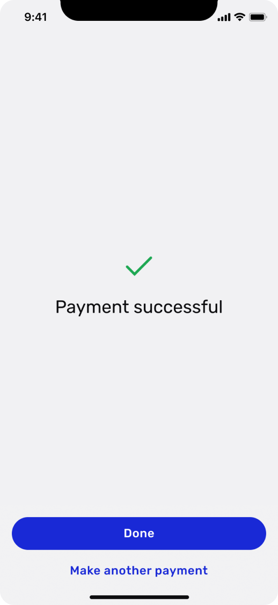
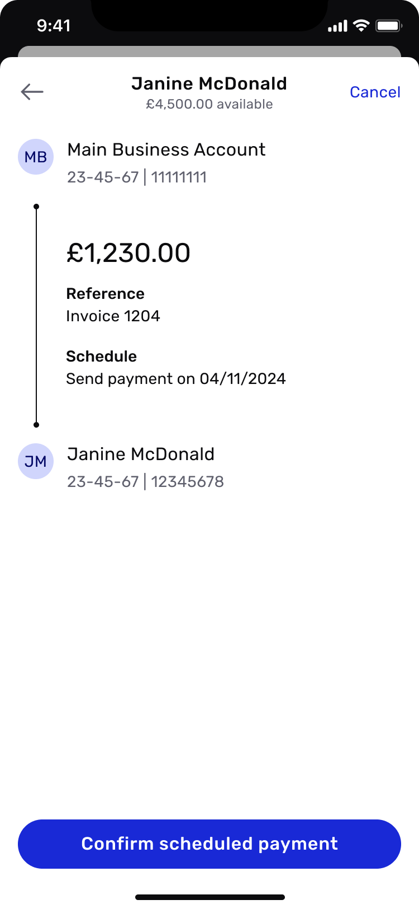
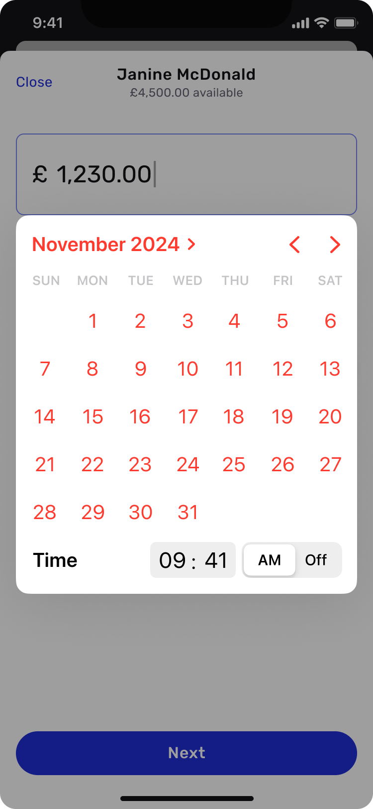
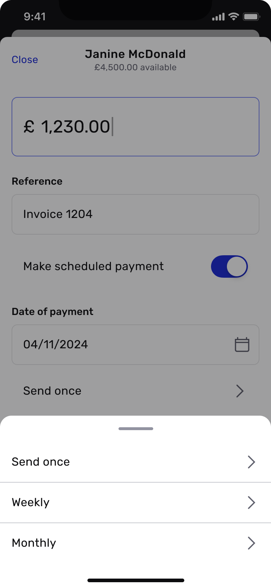
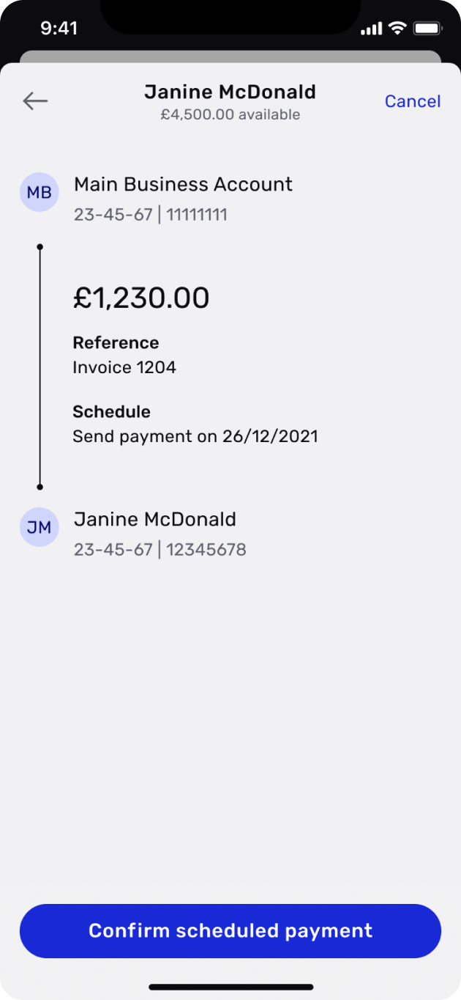

import Section from '../../components/Section.astro';
import LabelledBlock from '../../components/LabelledBlock.astro';
import PullQuote from '../../components/PullQuote.astro';
import StatTile from '../../components/StatTile.astro';
import StatGrid from '../../components/StatGrid.astro';
import Figure from '../../components/Figure.astro';
import ImageGrid from '../../components/ImageGrid.astro';
import CardGrid from '../../components/CardGrid.astro';
import Card from '../../components/Card.astro';
import Credits from '../../components/Credits.astro';

<Section number="01" title="Context">

<LabelledBlock label="The Brief">

Redesign Tide’s core domestic payment experience, delivering a seamless payment flow for UK SMEs.

</LabelledBlock>

<LabelledBlock label="The Architectural Challenge">

Consolidating several fragmented, legacy payment journeys into a single, dynamic flow that handles complex payment rules, validation, and edge cases. All while building UI architecture flexible enough to support future FX and international capabilities.

</LabelledBlock>

<LabelledBlock label="The Operational Win">

Streamlined the core payment UX to reduce cognitive friction and error rates, while establishing modular, reusable payment components that expanded Tide’s overall design system.

</LabelledBlock>

</Section>

<Section number="02" title="Research & Discovery">

### Vision workshop

Over two days, the team ran workshops to define the vision for the new payments proposition. We wanted a consistent target to aim for, as well as tangible guardrails for any future updates or integrations. We discussed:

*   _Who is the target audience?_
*   _What are their problems?_
*   _What is the product category?_
*   _What are the key benefits of this product?_
*   _What are its key advantages?_

We looked to our own in-house data to answer these questions, as well as other research materials from the likes of Accenture and McKinsey.

Next, we set definitions around four key factors — what the product is; what it is not; what it does; and what it doesn’t do. With this information, we wrote a final vision statement:

<PullQuote>

For SMEs who need to carry out essential tasks as they grow, our payment flow is an experience-led stream that can evolve to tackle any demands. Unlike banks, our product is convenient, adaptable and non-intrusive.

</PullQuote>

We were happy with this statement overall — the word ‘stream’ felt a little ambiguous but we liked the concept of the area resembling a river, with one main flow that has several smaller tributaries feeding into it.

So no matter your starting point, you always join a flow that is pre-existing, familiar and wholly governed by our team.

<Figure>

</Figure>

### Setting objectives

We defined some key objectives for the new payments area:

<CardGrid columns={2}>

<Card>
<Fragment slot="icon">

</Fragment>

We would align with business OKRs on member satisfaction and revenue

</Card>

<Card>
<Fragment slot="icon">

</Fragment>

Given its popularity, payments should become our company gold standard for UX

</Card>

<Card>
<Fragment slot="icon">

</Fragment>

Experience should be led by what our customers need, not our technical limitations

</Card>

<Card>
<Fragment slot="icon">

</Fragment>

We should combine disparate payment management features into a single payments ‘hub’

</Card>

</CardGrid>

### Heuristic review

In my review I identified a number of points within the existing payments flows. 37 overall – 13 severe issues, 11 intermediate issues and 13 that were performing well.

I prioritised these according to our objectives and impact vs effort, and addressed them in our design phase.

### Competitor analysis

We looked at payments products from challenger banks, High Street banks and investment apps.

It felt like almost all were converging on a similar interaction pattern – a single screen for amount and reference, with a toggle to display scheduling options.

Making a payment is never really a ‘fun’ experience; it’s functional and the user needs to have explicit trust.

In other words, rather than trying to reinvent the wheel, we should focus on external consistency, familiarity and affordance to let our customers get things done fast.

<Figure caption="Payment screens on Starling, Dave, Marcus and Betterment">

</Figure>

</Section>

<Section number="03" title="Design">

As we weren’t looking to explore new, exotic ways to present this product, I jumped almost straight into high-fidelity UI. We revisited our data from the discovery work and found some interesting ways that we could refine and streamline the design:

<CardGrid columns={2}>

<Card title="Recipients">
<Fragment slot="icon">

</Fragment>

46% of payments made by active customers had been to one of their three last-paid recipients

<Fragment slot="footer">

**Idea:** Provide a ‘Recent’ section in the recipients list to optimise the flow for paying these recipients

</Fragment>

</Card>

<Card title="Making multiple payments">
<Fragment slot="icon">

</Fragment>

19% of payments made by active customers were done less than 3 minutes after the previous one

<Fragment slot="footer">

**Idea:** Provide the ability to immediately make another payment upon submitting a payment

</Fragment>

</Card>

<Card title="Multiple account holders">
<Fragment slot="icon">

</Fragment>

80% of payments made by multiple account holders came from the primary account

<Fragment slot="footer">

**Idea:** Pre-select the primary account rather than making the customer select the ‘From’ account each time

</Fragment>

</Card>

<Card title="Payment management">
<Fragment slot="icon">

</Fragment>

The location of payment management features, such as managing Direct Debits and scheduled payments, was unintuitive

<Fragment slot="footer">

**Idea:** Bring these features into the main Pay tab under a secondary navigation

</Fragment>

</Card>

<Card title="Navigation">
<Fragment slot="icon">

</Fragment>

In a usability test, all users expected to be brought back to the main Account tab once a payment had been made

<Fragment slot="footer">

**Idea:** Take customers back to the main Accounts tab once done, alongside the ‘make another payment’ option

</Fragment>

</Card>

<Card title="Repeated payments">
<Fragment slot="icon">

</Fragment>

When scheduling a payment to repeat/defer, over 65% of payments were ‘send once’ (don’t repeat) and send ‘tomorrow’

<Fragment slot="footer">

**Idea:** By pre-selecting these options, we cater for nearly two-thirds of scheduled payments with a single tap

</Fragment>

</Card>

</CardGrid>

Throughout the process, we worked closely with engineering and compliance to bridge legacy limits with modern UI performance, ensuring zero disruption to daily business transactions.

Also, the way I designed payment cards, recipient selectors, and status states to be modular and reusable meant future teams could plug in FX and multi-currency rails without blowing up the core user mental model or rewriting the UI.

</Section>

<Section number="04" title="Final UI">

### Domestic payment

<ImageGrid cols={2} width="prose">

</ImageGrid>

### Scheduled payment

<ImageGrid cols={2}  width="prose">

</ImageGrid>

</Section>

<Section number="05" title="Conclusion">

The new area’s modular structure allowed new services like sending and receiving foreign currency, Open Banking or even multi-currency wallets to be implemented easily.

In terms of metrics, we were quite modest as this was such a crucial function within the app:

<StatGrid columns={4}>
  <StatTile value="7">point increase in our NPS (68 to 75)</StatTile>
  <StatTile value="9%">reduction in time-on-task</StatTile>
  <StatTile value="0">change to payment completion %</StatTile>
  <StatTile value="40%">reduction in flow churn (8.41% to 5%)</StatTile>
</StatGrid>

This project was a great exercise in collaboration and design thinking. Arnoud, Katie and I worked closely together over the course of several months, and our decisions were well thought out and backed by good research and data.

</Section>

<Section title="Credits">

<Credits
  role="Design Lead"
  tools={["Figma", "Mural", "Invision", "Usertesting.com"]}
  date="Spring/summer 2021"
  team={[
    "Arnoud de Nicolay, Product Manager",
    "Katie Hayward, UX Writer",
  ]}
/>

</Section>
