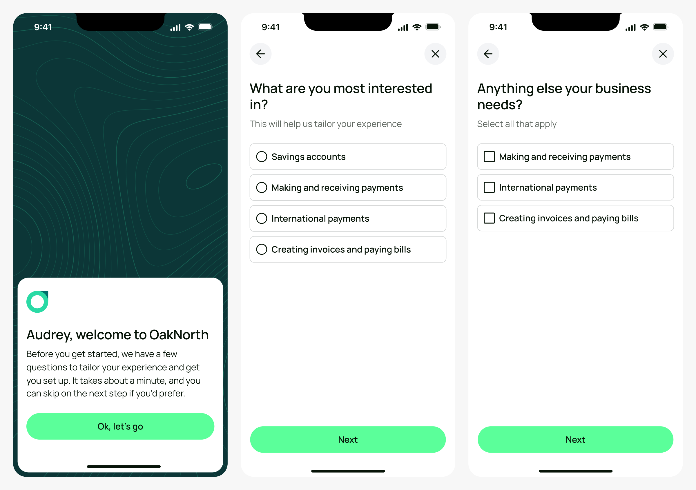
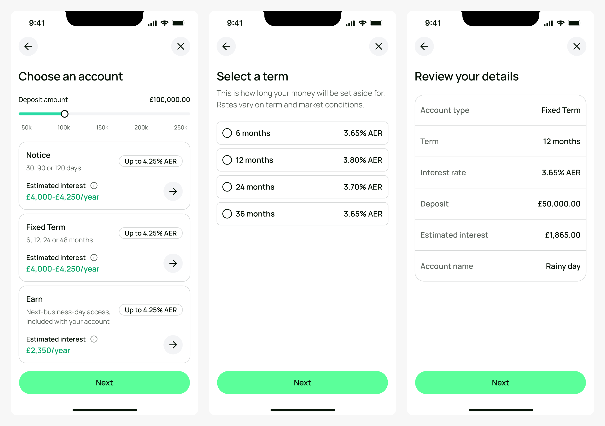
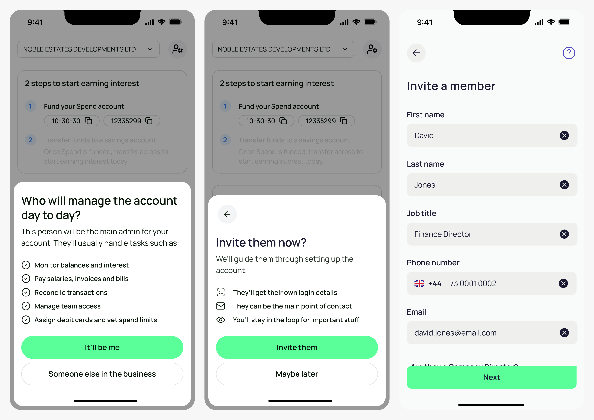
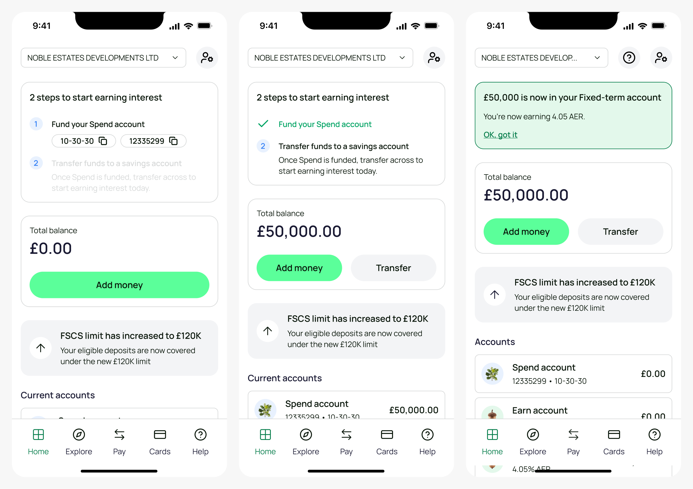
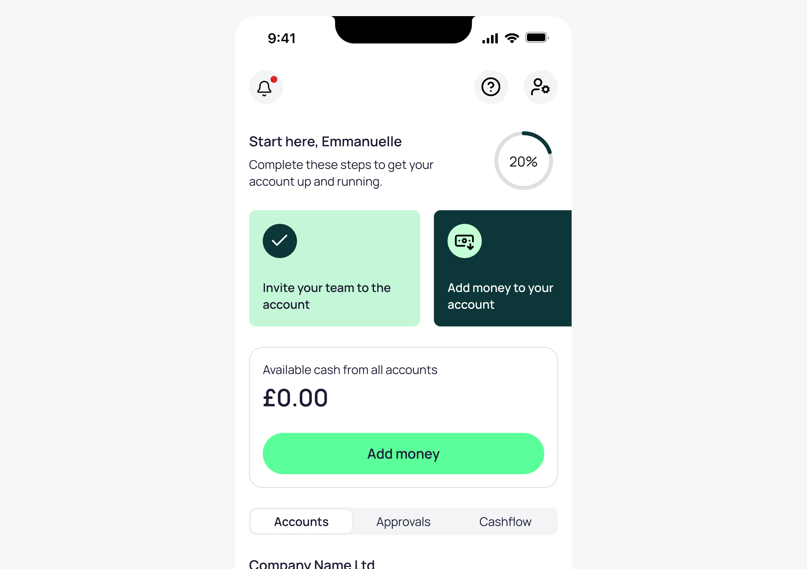

import Section from '../../components/Section.astro';
import LabelledBlock from '../../components/LabelledBlock.astro';
import StatTile from '../../components/StatTile.astro';
import StatGrid from '../../components/StatGrid.astro';
import Figure from '../../components/Figure.astro';
import Journey from '../../components/Journey.astro';
import Stage from '../../components/Stage.astro';
import Credits from '../../components/Credits.astro';

<Section number="01" title="Context">

<LabelledBlock label="The Brief">

Create a welcome experience to better understand customer intent, and direct them to the appropriate tools for their use case.

</LabelledBlock>

<LabelledBlock label="The Architectural Challenge">

Understanding where to focus efforts, given the company’s priorities; and tying together several ‘early-life’ initiatives into a cohesive, single experience.

</LabelledBlock>

<LabelledBlock label="The Operational Win">

Increased invites of operational users in line with predictions, and reduced time to fund for saving-intent customers.

</LabelledBlock>

</Section>

<Section number="02" title="Research & Discovery">

### Experience audit

<LabelledBlock label="Sub-par experience">

There was no ‘welcome’ experience in the Business Banking app at all. Once a customer got their application approved, they open the app and are met with nothing except an empty balance.

</LabelledBlock>

<LabelledBlock label="Customer intent">

Many customers sign up for business savings, but others have more operational needs like payments, team expense cards, accountancy integrations. We had no data on why they’d opened the account, or how we could support them.

</LabelledBlock>

<LabelledBlock label="Identifying the main point of contact">

For our ICP – UK SMEs with £1m–100m revenue – we had a strong hypothesis that the applicant wasn’t the one running the finances. The applicant had to be a company director, but for that size of company, they would likely have a finance director or CFO. Any engagement comms or marketing we sent would land squarely in the wrong place.

</LabelledBlock>

### Data

Looking at our customer data, we discovered:

<StatGrid columns={3}>
  <StatTile value="80%">Customers that had deposited less than £100k; many had deposited nothing at all</StatTile>
  <StatTile value="70%">had opted-out of marketing; we couldn’t reach out to them through traditional channels</StatTile>
  <StatTile value="90">Average days until complete customer disengagement</StatTile>
</StatGrid>

### Squad pivot

Looking at these datapoints, Ben proposed that we permanently change the focus of our squad, to address the post-approval, early customer experience.

When I joined the company, our squad was responsible for the entire in-life experience. This included the homepage, account details, team management, security, customer support – everything except payments and cards.

For a small team, this wasn’t manageable, and we felt that improving the first experience of new customers would yield significant benefits to the business.

</Section>

<Section number="03" title="Design">

### Mapping the journey

The aim of the welcome journey was to understand more about customer intent, so we can present useful information as soon as possible. Ben and I workshopped together and later with engineers, eventually landing on:

<Journey columns={4}>

<Stage title="Fact-find">
<Fragment slot="icon">

</Fragment>

We ask a couple of questions to identify your main reasons for applying

</Stage>

<Stage title="Open account">
<Fragment slot="icon">

</Fragment>

If the primary intent was for savings, the customer could do that immediately

</Stage>

<Stage title="Main admin">
<Fragment slot="icon">

</Fragment>

If you have a finance director or CFO, invite them to the account

</Stage>

<Stage title="First deposit">
<Fragment slot="icon">

</Fragment>

Once in the app, we show instructions on making your savings deposit

</Stage>

</Journey>

### Fact-find

A couple of simple questions to identify primary intent. I also built a Figma plugin to dynamically generate the topographic pattern seen on the first screen; this pattern has since become a core part of OakNorth’s new brand identity.

<Figure width="prose">

</Figure>

### Open account

If the customer is most interested in savings accounts, then after this section we prompted them to select a new savings account. Only about 5% of customers actually visited the Open Account screen once in the app, so this was a much-needed piece of discoverability.

We also provided functionality to help them estimate the interest they’d earn on each savings account – moving the slider updated the interest values on each card in real time.

<Figure width="prose">

</Figure>

### Identify main admin

As part of the discovery work on this, we ran an in-app survey to ask existing customers whether they were the main users of the account or if it was someone else in their business.

We’d had invite functionality for a long time, but this was a great opportunity to re-frame it and present it at a time when it would be most valuable, rather than hoping the customer stumbles across it themselves.

<Figure width="prose">

</Figure>

### Make deposit

OakNorth savings accounts lack visible account details. The only way to fund them is to make a manual bank transfer to your OakNorth current account, and then move the money within the app.

This caught out a number of customers who assumed their money was in the right place after their bank transfer, leading to missed interest. To mitigate this, we showed specific instructions within the app to guide customers through the process, and provide clear confirmation that their money was in the right place.

We pitched some more technical solutions to this, such as Open Banking implementation, but lack of resource meant we had to work around the existing infrastructure.

<Figure width="prose">

</Figure>

### Next steps: Operational customers

The initial focus for the welcome experience was operational; helping to introduce a wide variety of products and services to new customers, so that they are encouraged to create, activate, or at least be aware of what we offered.

However, given the business’ revenue focus, and the fact that in the short-term, revenue was only derived from deposit volume, not operational usage, we shifted to this more light-touch approach aimed at savers.

The next step would have been to implement the operational path, for those who select anything except (or as well as) savings accounts.

<Figure width="prose">

</Figure>

</Section>

<Section number="04" title="Results">

Overall the journey had quite significant impact on the early-life experience. It was a great exercise in seeing the result of simple yet valuable front-end improvements that didn’t require building new features or functionality. Just learn more about the customer, and help them meet their needs.

<StatGrid columns={3}>
  <StatTile value="28%">of new customers invited a colleague right away</StatTile>
  <StatTile value="5.5">reduction in days to first deposit (7.5 to 2)</StatTile>
  <StatTile value="13%">jump in customers meeting minimum deposit requirements</StatTile>
</StatGrid>

</Section>

<Section title="Credits">

<Credits
  role="Design Lead"
  tools={["Figma", "Claude Code", "Cursor", "Figjam", "Miro"]}
  date="Spring/summer 2026"
  team={[
    "Ben Evans, Senior Product Manager",
    "Blake Davies-Zietek, Senior Engineer",
    "Eugene Voronets, Senior Engineer",
  ]}
/>

</Section>
